# Watson Hands On Labs - 📷 Image Analysis

The labs cover several [Watson Services][wdc_services] that are available on [IBM Bluemix][bluemix] to build a simple image analysis application. Throughout the workshop, we will navigate through Bluemix, Bluemix Devops Services, Github, and the source code of our application in order to demonstrate how apps can be created quickly and easily using the [IBM Bluemix][bluemix] platform, and the value of [Watson Services][wdc_services] and Cognitive capabilities through APIs.

So let’s get started. The first thing to do is to build out the shell of our application in Bluemix.

## Creating a [IBM Bluemix][bluemix] Account

  1. Go to [https://console.ng.bluemix.net/](https://console.ng.bluemix.net/)
  2. Create a Bluemix account if required.
  3. Log in with your IBM ID (the ID used to create your Bluemix account)

**Note:** The confirmation email from Bluemix mail take up to 1 hour.

## Deploy this sample application in Bluemix and Test it

Leveraging the IBM Bluemix DevOps Services, we are able to quickly clone the code from any public GitHub repository, create the dependent Watson service instances, and deploy our application code with the click of a button.  To get started:

  1. Click the button below to fork the project into IBM DevOps Services and deploy your own instance of this application on [IBM Bluemix][bluemix].

  [](https://bluemix.net/deploy?repository=https://github.com/watson-developer-cloud/image-analysis)

  2. From here you will be taken to a Bluemix page, where you will be prompted to name your app. A sample name is provided for you, but feel free to give your application any name you like (if the name is taken by another user you will be prompted to try another name).

  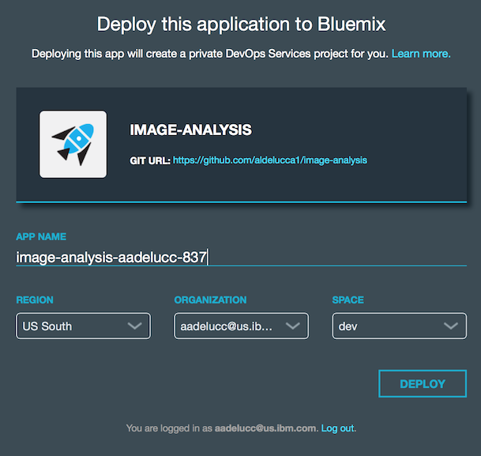

  **Note:** Use the default settings for Region / Organization / Space on the Bluemix landing page.

  3. Once you have named your application, click the deploy button to begin the deploy process to Bluemix. During this process, Bluemix will automatically build and deploy our starter application based on the Github repository that we accessed at the start of the lab.

  4. Once the application has finished deploying, you will see a "Success!" message. At this point, scroll to the top of the page and select "Dashboard" from the header bar.

  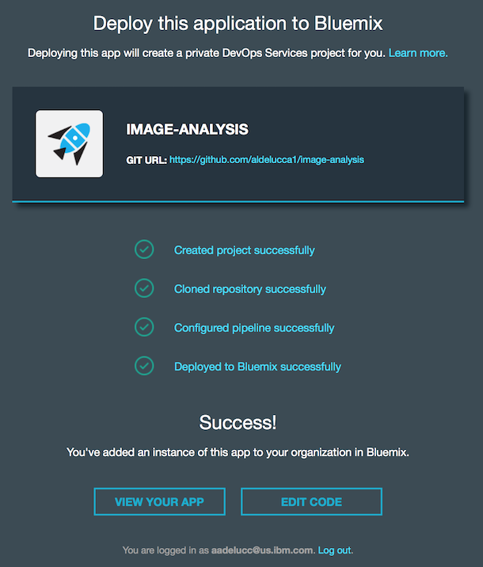

  5. Test Out the new app. Now that we have deployed our application to Bluemix, the next step is to test the application in it's current state.

  6. Click on the application icon to go into the dashboard for our Image Analysis app. On the `Overview` tab you will see the details for your application. To the right of the application title, you will see a `View app` button. Click on the button and you will be taken to your running application.

  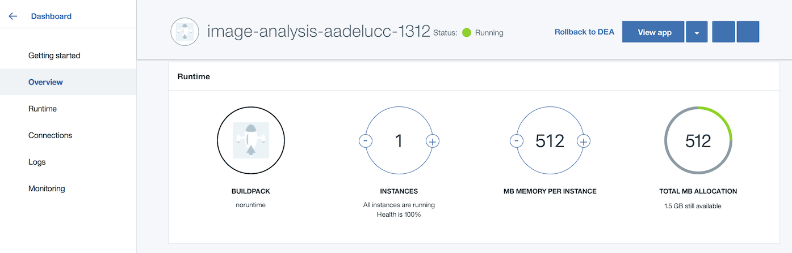

  7. In the application, try selecting the upload button in the top right corner and uploading a picture. We have a provided a few pictures to test out the application in the repo at https://github.com/watson-developer-cloud/image-analysis/tree/master/public/images

  Simply download one of the pictures in the folder and upload it into the application to have Watson analyze the image.

  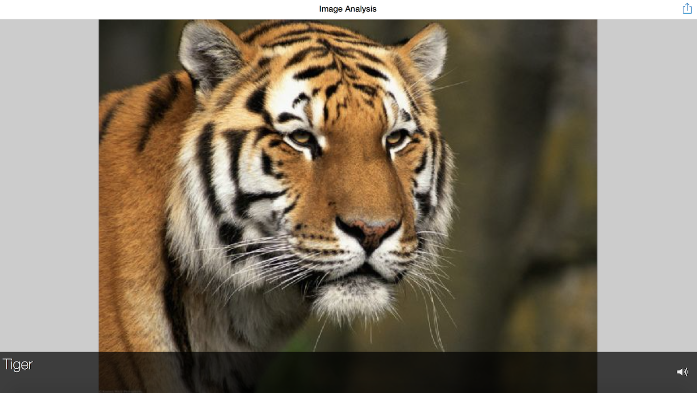

  8. When the image has been recognized, click on the Speaker icon to hear the ID of the image.

## Add additional services to the application

  1. So far, we have deployed our pre built starter application to Bluemix. We are going to show how easy it is to add additional Watson services to our applications using Bluemix.

  On the Bluemix Dashboard, scroll down to find your Image Analysis application within the "Applications" section. From here, click on the application to open the application homepage.

  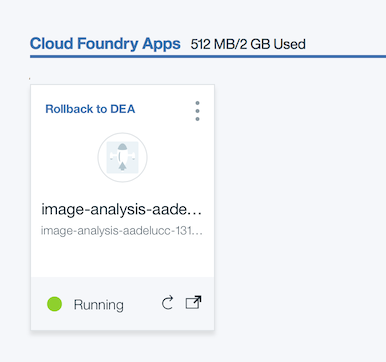

  2. Within the application homepage, we are able to see what services we have already included. To do this, select the `Connections` item from left navigation. You will notice that we already have Text to Speech and Visual Recognition built into the application. We are now going to add a third service into the application.
To do this, click the `Connect new` button on the Connections tab

  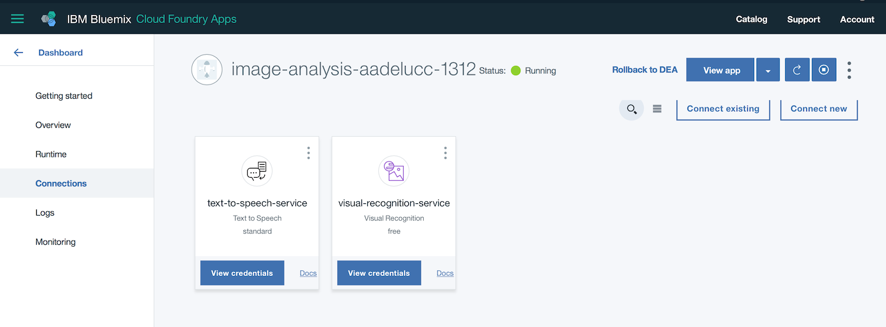

  3. From the list of Watson services, select the `Language Translator` service and add it to your application. For the purposes of this lab, all of the default settings of the service will work, so when presented with the Language Translator details page, select the green `Create` button to proceed.

  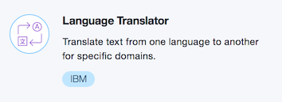

  **Note:** you may be prompted to restage your application at this point. This is required in order to rebuild the application with the new Language Translator service that we have added. Select "Restage" to proceed.

We are going to demonstrate how easy it is to use the Watson services on Bluemix to add functionality to existing applications. Our current application can identify images and read out that identification using audio. However let’s say that we wanted to be able to identify these images for a wider user base, which requires translation into other languages.

Luckily, we’ve already started the process to do this. To fully implement the ability to translate these descriptions in our application, we are going to edit our application code to add the Language Translator service that we added earlier.

## Modify the existing application

  1. Let’s edit our source code. Back on the application home page in Bluemix, you will see a link to the IBM Bluemix Devops Jazz Hub repository, and a button to **Edit Code**.
  Click on **Edit Code.**

  2. Clicking on Edit Code will take you to the Jazz Hub repository, which will allow us to edit and push new versions of our code to the application.

  Within the Github repository, navigate to routes folder and select **File -> New -> File** and name the new file `language-translator.js`

  3. Open up `language-translator.js` and copy the code below:  

```js
'use strict';

var watson = require('watson-developer-cloud');

var languageTranslator = watson.language_translator({
  url: 'https://gateway.watsonplatform.net/language-translator/api',
  version: 'v2',
  username: '<service_username>',
  password: '<service_password>'
});

module.exports.translate = function(req, res, next) {
  var params = {
    text: req.body.text,
    model_id: 'en-es',
  };
  languageTranslator.translate(params, function(error, result) {
    if (error)
      return next(error);
    else
      return res.json(result);
  });
};
```
  Note: Make sure to replace service_username & service_password with the username & password of the Language Translator service added.
  The code above will connect the app to the [Language Translator][lt_service] service.

  4. Click on File -> Save or press Crt+S.

  5. Open up your `app.js` and uncomment the line 31. That will add the support for translation with the newly created `routes/language-translator.js`.

  6. Click on File -> Save or press Crt+S.

## Deploy

  1. The last step in order to complete our application is to deploy our changes to Bluemix. To do this, we need to push our new code to the application. In the code editor screen, switch to the Git view, the 2nd icon in the left navigation bar.

  

  2. Locate your change to app.js file. Check it (select it), add a commit message, and click **Commit**.

  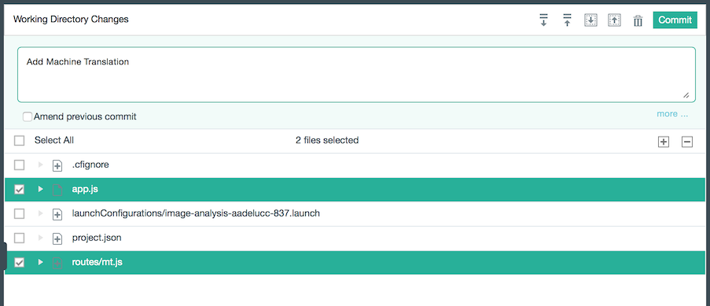

  3. Click **Sync** to send your changes from this workspace to the main repository and trigger a deploy of your app.

  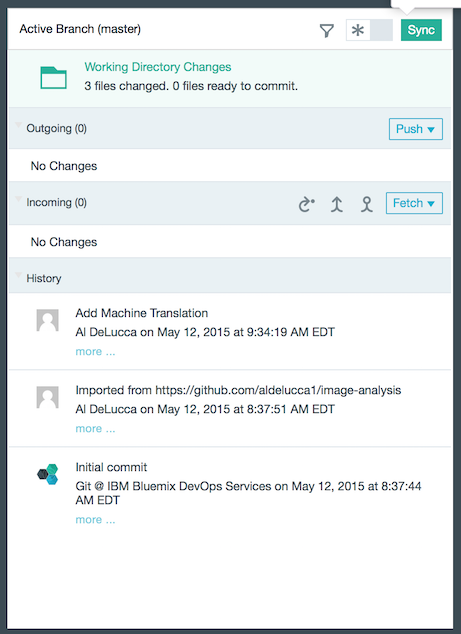

  4. Finally, Click on **Build and Deploy** to see the deploy process.

  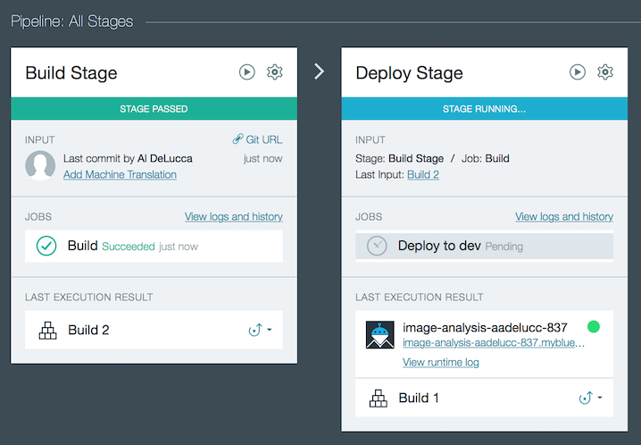

**Note:** While this may show as overly complicated, we show it here to illustrate you can have exactly the same source management practices you could have your local environment connected to a Git repository, in the Bluemix DevOps environment.

## Test

To test out our application, navigate back to your application in Bluemix and click the `View app` button in the same way that we launched our previously unfinished application before.
The new application will perform the same functions are our previous version, but this time in addition to the english text you saw before, you will see translation for the images as well.

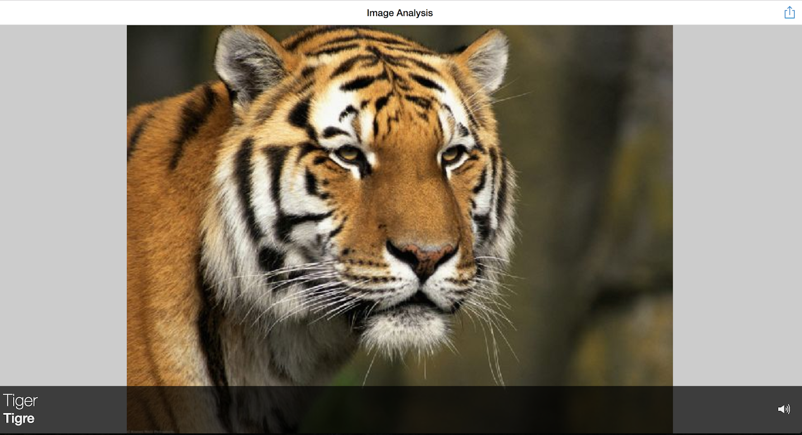

## Extra Credit - Training

While the default Visual Recognition does a good job classifying many common objects, it is possible to extend its accuracy by training custom classifiers. A new custom classifier can be trained by invoking an API, passing several compressed (.zip) files, including files containing positive or negative images (.jpg, or .png). Compressed files containing positive examples are used to create “classes” that define what the new classifier is. The compressed file containing negative examples is not used to create a class within the created classifier, but does define what the new classifier is not. Negative example files should contain images that do not depict the subject of any of the positive examples.

1. Download the sample training images to your local machine by clicking the links below:

  [Fruit Bowls - Positive](https://watson-labs.mybluemix.net/data/fruitbowl.zip)
  <br/>
  [Not Fruit Bowls - Negative](https://watson-labs.mybluemix.net/data/not-fruit-bowls.zip)

2. Using the zips downloaded above execute the classify call to create a new instnce of a classifier.

``` sh
curl -X POST -F "fruitbowl_positive_examples=@fruitbowl.zip" -F "negative_examples=@not-fruit-bowls.zip" -F "name=fruitbowls" "https://gateway-a.watsonplatform.net/visual-recognition/api/v3/classifiers?api_key={api_key}&version=2016-05-20"
```

The response to creating a classifier will contain the `classifier_id` of your newly created instance, along with its current `status`.

``` json
{
    "classifier_id": "fruitbowls_206030696",
    "name": "fruitbowls",
    "owner": "0e03a4bf-6b50-461d-a21d-ccdc32fe0906",
    "status": "training",
    "created": "2016-11-08T22:23:39.034Z",
    "classes": [{"class": "fruitbowl"}]
}
```

You can check the `status` of your classifier by listing all your classifiers as follows:

``` sh
curl -X GET "https://gateway-a.watsonplatform.net/visual-recognition/api/v3/classifiers?api_key={api_key}&version=2016-05-20"
```

``` json
{
    "classifiers": [{
        "classifier_id": "fruitbowls_206030696",
        "name": "fruitbowls",
        "status": "ready"
    }]
}
```

Once your classifier is `ready` you can start classifying images using it.

### Classify an image against the new classifier

We are now ready to re-classify our image using our new custom classifer.  Like before we will invoke the `classify` endpoint.  Unlike before, this time we will pass the set of `classifier_ids` to use to classify.  Here we will send in the `default` classifier along with the `classifier_id` of our custom classifer.

``` sh
curl -X GET "https://gateway-a.watsonplatform.net/visual-recognition/api/v3/classify?api_key={api_key}&url=https://github.com/watson-developer-cloud/doc-tutorial-downloads/raw/master/visual-recognition/fruitbowl.jpg&version=2016-05-19&classifier_ids={classifier_id},default"
```

Our response will look similar to before, but will now include the classifer results from our custom classifier.

``` json
{
    "custom_classes": 1,
    "images": [
        {
            "classifiers": [
                {
                    "classes": [
                        {
                            "class": "fruit",
                            "score": 0.937027,
                            "type_hierarchy": "/foods/fruit"
                        },
                        {
                            "class": "apple",
                            "score": 0.668188
                        },
                        {
                            "class": "banana",
                            "score": 0.549834,
                            "type_hierarchy": "/foods/fruits/banana"
                        },
                        {
                            "class": "food",
                            "score": 0.524979
                        },
                        {
                            "class": "orange",
                            "score": 0.5,
                            "type_hierarchy": "/colors/orange"
                        }
                    ],
                    "classifier_id": "default",
                    "name": "default"
                },
                {
                    "classes": [
                        {
                            "class": "fruitbowl",
                            "score": 0.55598
                        }
                    ],
                    "classifier_id": "fruitbowls_206030696",
                    "name": "fruitbowls"
                }
            ],
            "resolved_url": "https://raw.githubusercontent.com/watson-developer-cloud/doc-tutorial-downloads/master/visual-recognition/fruitbowl.jpg",
            "source_url": "https://github.com/watson-developer-cloud/doc-tutorial-downloads/raw/master/visual-recognition/fruitbowl.jpg"
        }
    ],
    "images_processed": 1
}
```

# Congratulations
You have completed the Image Analysis Lab! :bowtie:

[bluemix]: https://console.ng.bluemix.net/
[wdc_services]: http://www.ibm.com/watson/developercloud/services-catalog.html
[lt_service]: http://www.ibm.com/watson/developercloud/language-translator.html
